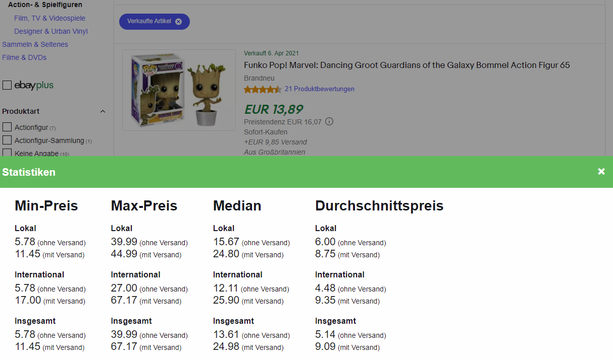

# ebay-price-companion
Calculates statistics for sold items and tries to calculate complete price incl. shipping on normal overview and product details.

The prices are extracted from the page so if there are listings for different items than the one you searched for, 
they will also be part of the calculation!

**Works only in German and in sold overview atm! Early alpha!**

**No guarantee for right calculations!!**   

*The design of the site also matters, there is a layout with different page elements where the modal won't work*
#Installation
Install [Tampermonkey](https://www.tampermonkey.net/) and then use the following link to install this userscript:
https://github.com/TheRealKerel/ebay-price-companion/raw/main/ebay-price-companion.user.js

# Screenshots

